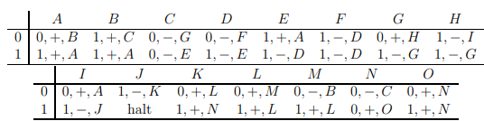

# TuringMachineU152

This project is a Java implementation of a Turing machine, specifically the U15,2 Turing machine. 
A Turing machine is a mathematical model of computation that manipulates symbols on a strip of tape according 
to a table of rules. Despite the model's simplicity, given any computer algorithm, 
a Turing machine capable of simulating that algorithm's logic can be constructed.

Project was inspired by the [Memory Augmented Large Language Models are Computationally Universal](https://arxiv.org/abs/2301.04589) paper.

## Classes

### TuringTape

A Turing tape is an infinite tape that contains symbols from a finite alphabet. The tape is divided into cells, 
and each cell contains a symbol from the alphabet. The tape has a head that can read and write symbols, 
and move left or right. This particular tape is a binary Turing tape,
which means that the alphabet contains only 0s and 1s.

### State

This abstract class represents the states of the Turing Machine. The Turing Machine has 15 states, 
which are represented by the inner classes of this class. For the sake of simplicity, 
the states are named A, B, C, D, E, F, G, H, I, J, K, L, M, N and O. 
Each state has a method `nextState(TuringTape)` that returns the next state of the Turing Machine.

States of the Turing Machine U15,2:



Left most column represents a symbol currently read from the tape. Top row represents the current state 
of the Turing Machine.
Each cell represents: symbol to write, direction to move (+ right, - left), next state.

### TuringMachineU152

This class represents the U15,2 Turing machine. It is constructed with a given maximum number of iterations, 
initial tape and initial state. The Turing machine runs until the maximum number of iterations 
is reached or the current state is null.

## Usage

You can find the main method in the TuringMachineU152 class.

To use this project, you need to initialize the Turing machine with the tape and the initial state. 
Then, you can run the Turing machine. Here is an example:

```java
ArrayList<Integer> initialTape = new ArrayList<>();
initialTape.add(1);
initialTape.add(0);
initialTape.add(1);
initialTape.add(1);
initialTape.add(1);
initialTape.add(1);
initialTape.add(1);
initialTape.add(1);

TuringMachineU152 turingMachineU152 = new TuringMachineU152(30, initialTape, new State.StateE());
turingMachineU152.run();
```
In this example, the initial tape is [1, 0, 1, 1, 1, 1, 1, 1], the maximum number of iterations is 30, 
and the initial state is StateE.